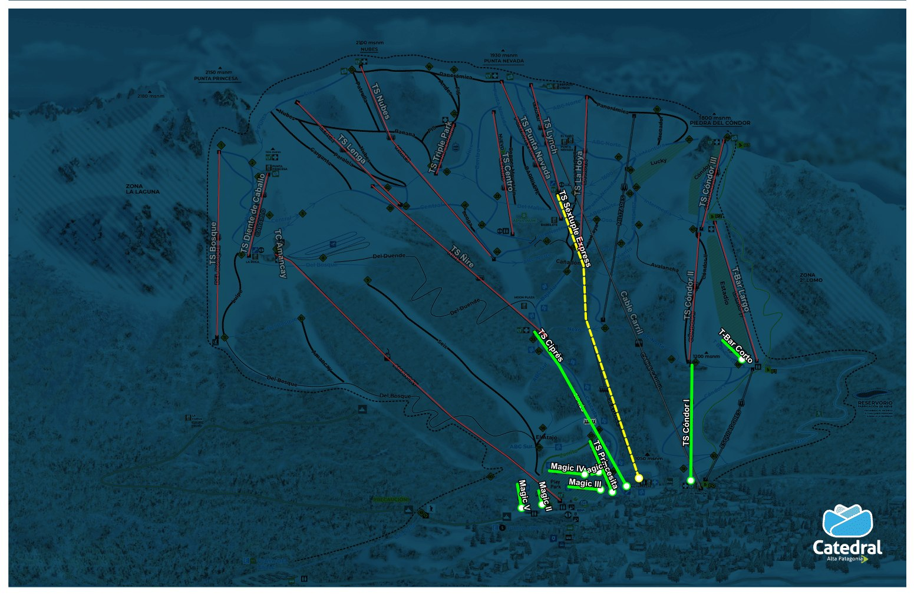
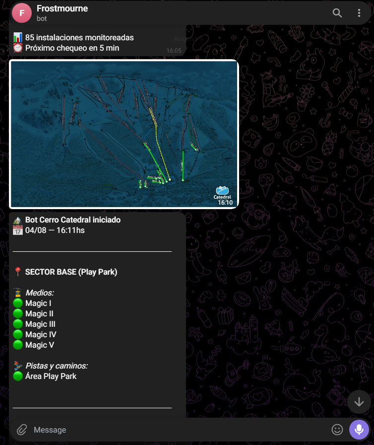

# Cerro Catedral Bot

A Telegram bot that monitors the status of ski slopes and lifts at Cerro Catedral in real time. It uses Puppeteer to fetch data from the official website and generates an interactive visual map whenever it detects changes.





> 🇪🇸 **[Versión en Español abajo](#versión-en-español)**


## Prerequisites

- **Node.js** (version 20 or higher recommended)
- A Telegram bot token (obtained by talking to [@BotFather](https://t.me/BotFather))
- Your Telegram chat ID (where the bot will send the messages)

## Initial Setup

1. **Clone the repository and enter the directory:**
   ```bash
   git clone <your-repo-url> cerro-bot
   cd cerro-bot
   ```

2. **Install dependencies:**
   ```bash
   npm install
   ```

3. **Configure environment variables:**
   Copy the `.env.example` file and rename it to `.env`:
   ```bash
   cp .env.example .env
   ```
   Open the `.env` file and fill in your data:
   ```env
   TELEGRAM_TOKEN=your_telegram_token
   TELEGRAM_CHAT_ID=your_chat_id
   ```

## Running on Windows

Running the bot on Windows is very simple as it doesn't require configuring complex system services.

1. Open a terminal (PowerShell or Command Prompt) in the project folder.
2. Run the bot:
   ```powershell
   node index.js
   ```
3. You will see the message `🏔️ Bot observer iniciado` and you will instantly receive a summary on Telegram with the generated map.
4. To stop the bot, press `Ctrl + C` in the console.

*(Optional) If you want the bot to always run in the background on Windows, you can use `pm2`:*
```powershell
npm install -g pm2
pm2 start index.js --name cerro-bot
```

## Running on Linux (Ubuntu/Debian)

If you are going to deploy it on a Linux server, it is recommended to use PM2 to keep it alive.

1. **Install system dependencies for Puppeteer (headless Chrome):**
   If you skip this step, the bot might run but crash silently when trying to open the browser.
   ```bash
   sudo apt update
   sudo apt install -y ca-certificates fonts-liberation libasound2 libatk-bridge2.0-0 libatk1.0-0 libc6 libcairo2 libcups2 libdbus-1-3 libexpat1 libfontconfig1 libgbm1 libgcc1 libglib2.0-0 libgtk-3-0 libnspr4 libnss3 libpango-1.0-0 libpangocairo-1.0-0 libstdc++6 libx11-6 libx11-xcb1 libxcb1 libxcomposite1 libxcursor1 libxdamage1 libxext6 libxfixes3 libxi6 libxrandr2 libxrender1 libxss1 libxtst6 lsb-release wget xdg-utils
   ```
2. **Run with PM2:**
   ```bash
   npm install -g pm2
   pm2 start index.js --name cerro-bot
   pm2 startup
   pm2 save
   ```

## How does it work?

1. **Continuous Monitoring:** The bot uses `node-cron` to query the official website every 4 minutes.
2. **Map Generation:** It relies on `sharp` and an SVG generated on the fly to draw the current status of the slopes on `assets/mapa_base.png`. Then it saves the result in `assets/mapa_estado_actual.png` and sends it to you.
3. **Persistent State:** The current state of the mountain is saved locally in the `estado_catedral.json` file. If you restart the bot, it will read this file to avoid sending duplicate notifications and know exactly what changed since the last time.

---

# Versión en Español

Un bot de Telegram que monitorea el estado de las pistas y medios de elevación del Cerro Catedral en tiempo real. Utiliza Puppeteer para consultar la web oficial y genera un mapa visual interactivo cada vez que detecta cambios.

## Requisitos Previos

- **Node.js** (versión 20 o superior recomendada)
- Un token de bot de Telegram (se obtiene hablando con [@BotFather](https://t.me/BotFather))
- El ID de tu chat de Telegram (donde el bot enviará los mensajes)

## Configuración Inicial

1. **Clonar el repositorio y entrar a la carpeta:**
   ```bash
   git clone <tu-url-del-repo> cerro-bot
   cd cerro-bot
   ```

2. **Instalar dependencias:**
   ```bash
   npm install
   ```

3. **Configurar variables de entorno:**
   Copia el archivo `.env.example` y nombralo `.env`:
   ```bash
   cp .env.example .env
   ```
   Abre el archivo `.env` y completa con tus datos:
   ```env
   TELEGRAM_TOKEN=tu_token_de_telegram
   TELEGRAM_CHAT_ID=tu_chat_id
   ```

## Ejecución en Windows

En Windows, ejecutar el bot es muy sencillo ya que no requiere configurar servicios de sistema complejos.

1. Abre una terminal (PowerShell o Símbolo del sistema) en la carpeta del proyecto.
2. Ejecuta el bot:
   ```powershell
   node index.js
   ```
3. Verás el mensaje `🏔️ Bot observer iniciado` y al instante te llegará un resumen a Telegram con el mapa generado.
4. Para detener el bot, presiona `Ctrl + C` en la consola.

*(Opcional) Si quieres que el bot corra siempre de fondo en Windows, puedes usar `pm2`:*
```powershell
npm install -g pm2
pm2 start index.js --name cerro-bot
```

## Ejecución en Linux (Ubuntu/Debian)

Si lo vas a desplegar en un servidor Linux, es recomendable usar PM2 para mantenerlo vivo.

1. **Instalar dependencias del sistema para Puppeteer (Chrome headless):**
   Si omites este paso, el bot se ejecutará pero crasheará de fondo al intentar abrir el navegador (no enviará mensajes).
   ```bash
   sudo apt update
   sudo apt install -y ca-certificates fonts-liberation libasound2 libatk-bridge2.0-0 libatk1.0-0 libc6 libcairo2 libcups2 libdbus-1-3 libexpat1 libfontconfig1 libgbm1 libgcc1 libglib2.0-0 libgtk-3-0 libnspr4 libnss3 libpango-1.0-0 libpangocairo-1.0-0 libstdc++6 libx11-6 libx11-xcb1 libxcb1 libxcomposite1 libxcursor1 libxdamage1 libxext6 libxfixes3 libxi6 libxrandr2 libxrender1 libxss1 libxtst6 lsb-release wget xdg-utils
   ```
2. **Ejecutar con PM2:**
   ```bash
   npm install -g pm2
   pm2 start index.js --name cerro-bot
   pm2 startup
   pm2 save
   ```

## ¿Cómo funciona?

1. **Monitoreo Continuo:** El bot usa `node-cron` para consultar la web oficial cada 4 minutos.
2. **Generación del Mapa:** Se apoya en `sharp` y un SVG generado al vuelo para dibujar el estado actual de las pistas sobre `assets/mapa_base.png`. Luego guarda el resultado en `assets/mapa_estado_actual.png` y te lo manda.
3. **Estado Persistente:** El estado actual del cerro se guarda localmente en el archivo `estado_catedral.json`. Si reinicias el bot, leerá este archivo para no enviar notificaciones duplicadas y saber qué cambió exactamente desde la última vez.
